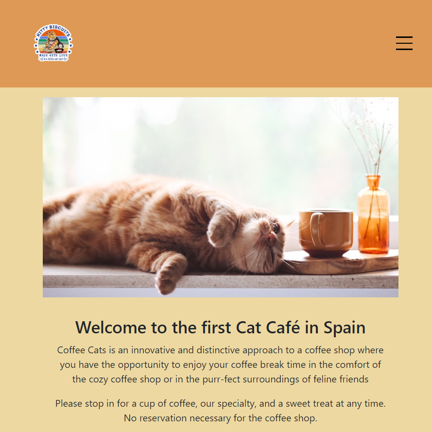
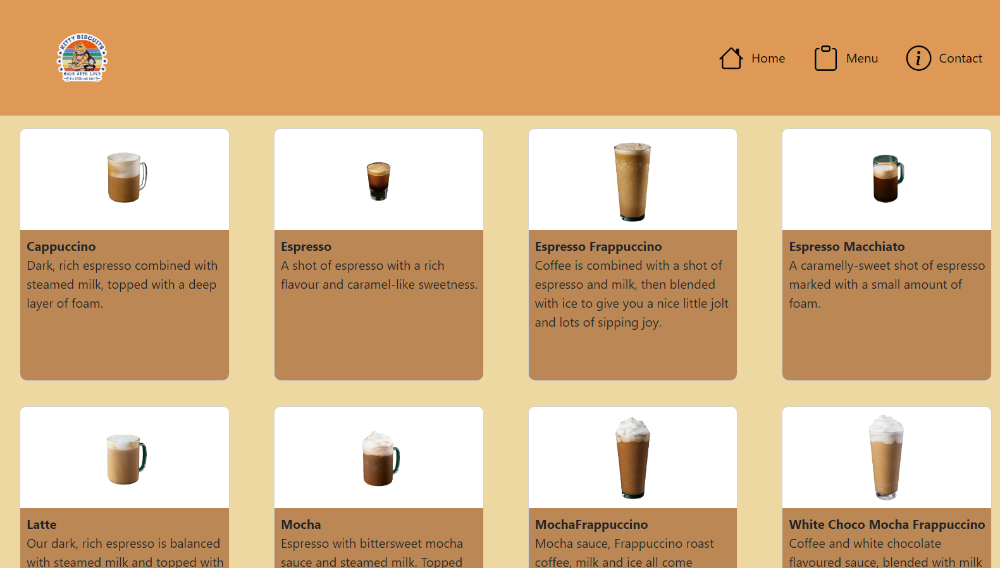
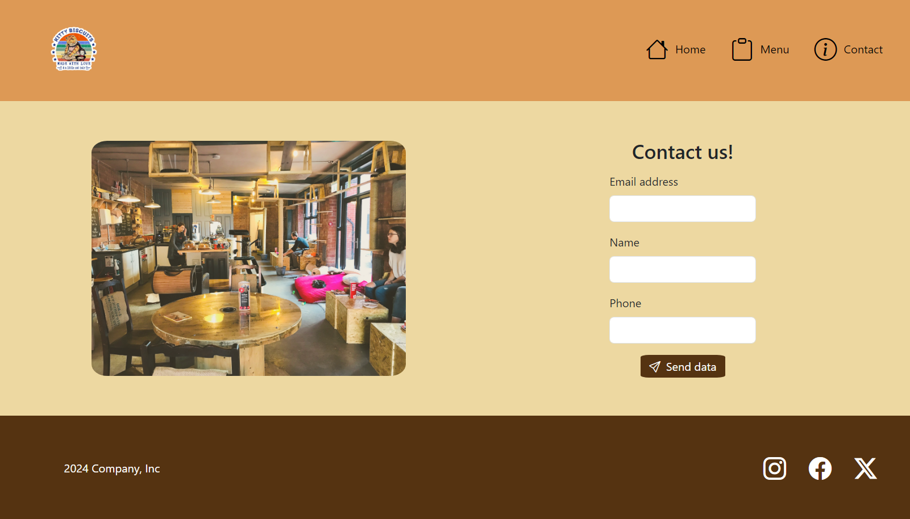

<h1 align="center">
   
  
   
  KittyBiscuits
   
</h1>

<h4 align="center">Sample for commerce webs related to restoration.</h4>

  <a href="#key-features">Key Features</a> •
  <a href="#project-objective">Project objective</a> •
  <a href="#demo">Demo</a> •
  <a href="#stack">Stack</a> •
  <a href="#future-improvements">Future improvements</a> •
  <a href="#views">Views</a> •
  <a href="#support">Support</a> •
  <a href="#you-may-also-like">You may also like...</a>

## Key Features

* Triple section for the main features needed for a restaurant commerce
* Responsive application from laptops to mobile phones
* GitHub controlled develop
* Stylish result using Boostrap technologies

## Project objective

This website is a project to show the first abilities I'm learning with the frontend technologies like CSS, Bootstrap or HTML. Is a first contact with the Full-Stack developing tasks and goals that I have as a programer.

## Demo

You can try the [demo](https://cariblagit.github.io/KittyBiscuits/) the latest version of KittyBiscuits for your explorer.

## Stack

 

## Future improvements

⬜ Block vertical movement when the nav menu is open in mobile format
 
⬜ Adding more data to the user on the landing page about the coffee shop
 
⬜ Making the form totally functional with Javascript
 
⬜ Adding more products to the website on the menu

## Views

Landing page - mobile format

Menu

Contact

## Support

## You may also like...

- [Between Sins](https://gitlab.com/daghdha1/betweensins) - RPG videogame 
- [Mars Alienated](https://gitlab.com/AdrianGarciaAndreu/mars-alienated-rv-htc) - VR escape room experience in a space station

